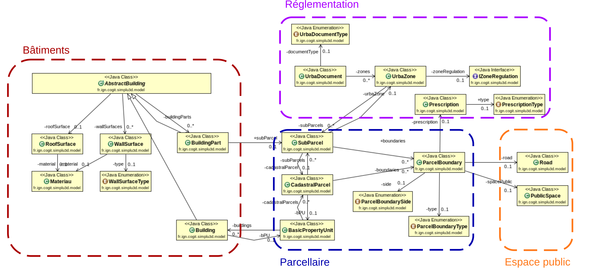
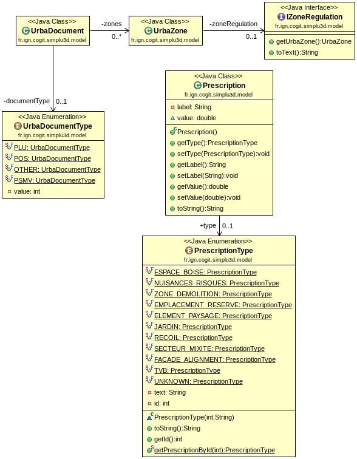
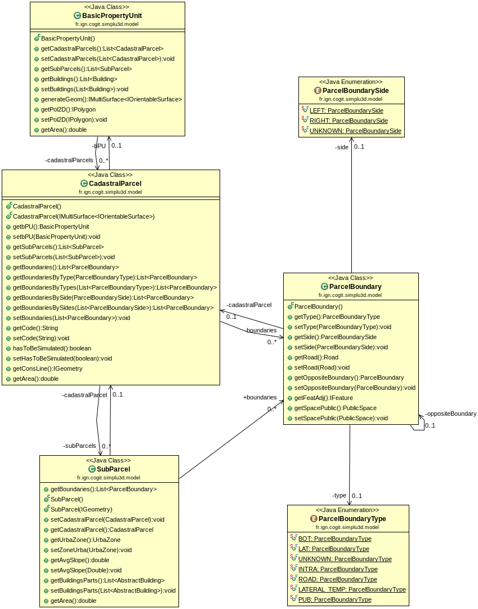
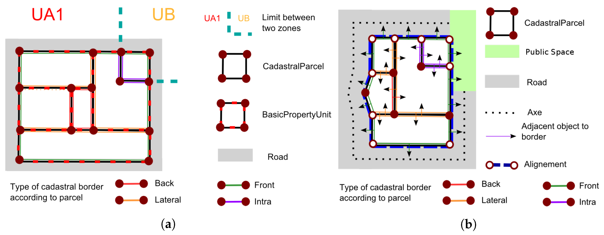
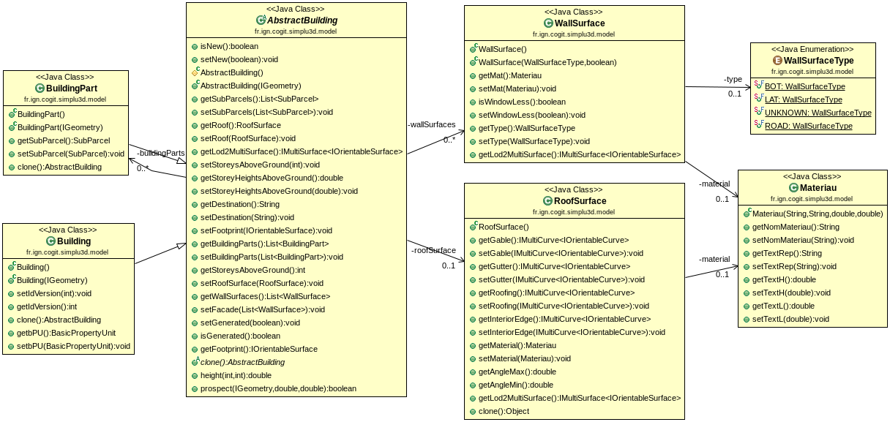
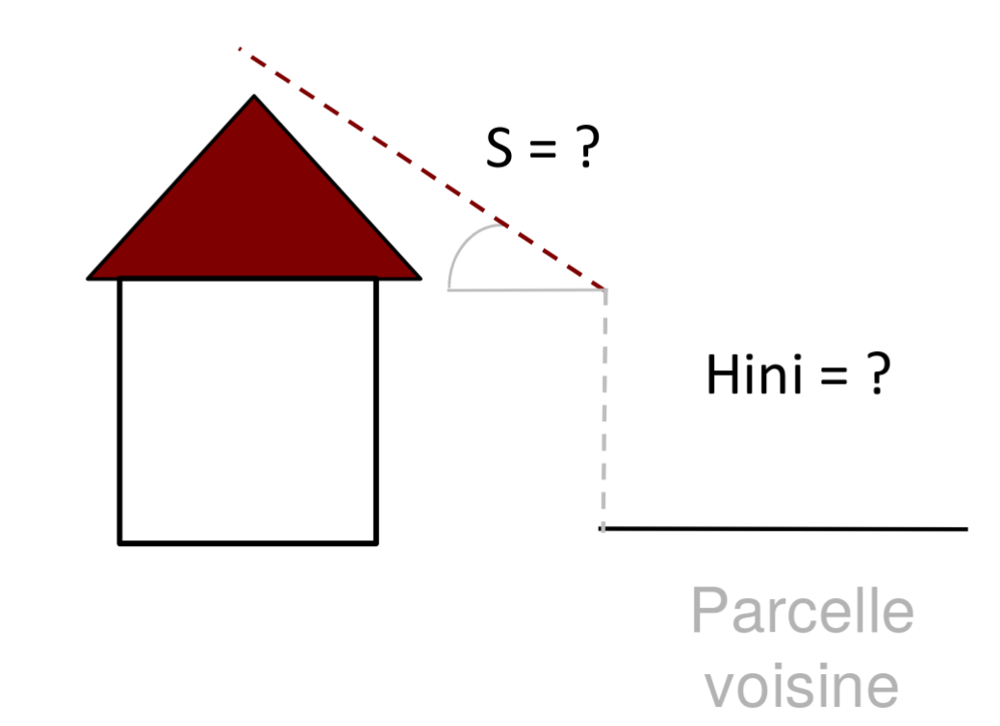
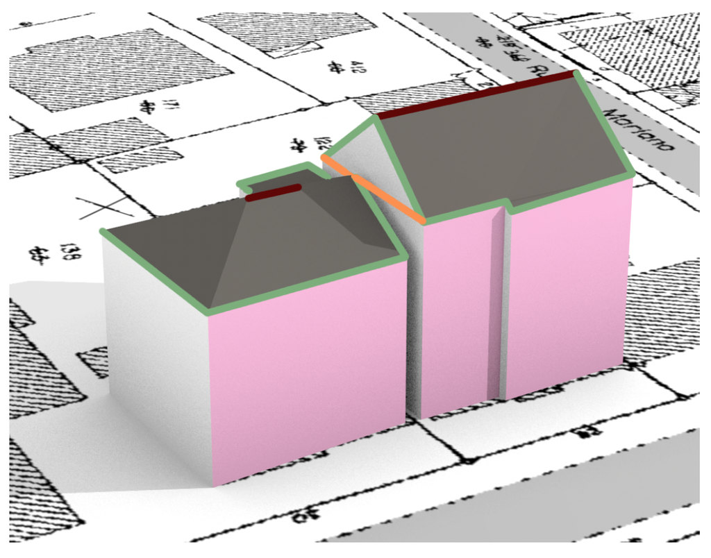
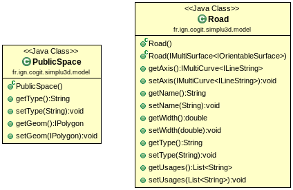

# Modèle géographique détaillé

Le modèle géographique a pour objet de décrire les objets à partir desquels il est possible de définir des contraintes morphologiques et notamment de décrire une réglementation urbaine. Le modèle proposé dans SimPLU3D a été établi pour modéliser les contraintes spécifiquement issues des [Plans Locaux d'Urbanisme](https://fr.wikipedia.org/wiki/Plan_local_d%27urbanisme). Ainsi, le modèle contient les concepts que l'on retrouve dans ces documents. Ce modèle a été produit à partir de la lecture de plusieurs PLU et des [fiches méthodologiques d'écriture des PLU du GRIDAUH](http://www.gridauh.fr/comptes-rendus-de-travaux/ecriture-des-plu/). Par exemple, si l'on considère la règle suivante :

le modèle permet de représenter les objets géographiques (en rouge), les propriétés (en bleu) et les relations (en vert). Ensuite, ces informations seront utilisées pendant la simulation pour vérifier si une configuration bâtie respecte ou non la règle formée par cette phrase. La prise en compte de telles contraintes est décrite dans la section [définition de contraintes morphologiques](../rules/intro.md).

Pour en savoir plus, le modèle a fait l'objet d'une publication scientifique :

> Brasebin, M., J. Perret, S. Mustière and C. Weber (2016) A Generic Model to Exploit Urban Regulation Knowledge, ISPRS International Journal of Geo-Information, vol. 5, n. 2, pp. 14, [doi:10.3390/ijgi5020014](https://www.mdpi.com/2220-9964/5/2/14)

# Vue global du modèle

Le modèle géographique est instancié dans le package *fr.ign.cogit.simplu3d.model* du projet [SimPLU3D-rules](https://github.com/SimPLU3D/simplu3D-rules). La javadoc est [consultable en ligne](https://simplu3d.github.io/simplu3D-rules/).

*(Vous pouvez cliquer sur l'image pour l'avoir en pleine résolution)*

 La figure précédente présente l'ensemble des classes (sans leurs attributs) composant le modèle géographique de SimPLU3D. Quatre ensembles de classes seront présentées :

 - [les classes représentant la réglementation](#classes-de-reglementation), c'est à dire les documents, les règles et les plans de zonage issus du PLU (ou d'autres réglementations locales) ;
 - [les classes modélisant le parcellaire](#classes-du-parcellaire) ;
 - [les classes concernant la modélisation 3D des bâtiments](#classes-des-batiments) ;
 - [les classes concernant les espaces publiques](#classes-de-lespace-publique).

 Avant de présenter les classes, la classe [parent *Environnement*](#classe-environnement) sera décrite, elle permet d'accéder aux différents objets du modèle.

Le modèle est certes complexe dans l'absolu, néanmoins il n'est pas nécessaire (comme présenté dans l'[exemple de la simulation basique](../begin/first_simulation.md)) de renseigner toutes les classes pour permettre l'exécution du modèle. Seules les classes relatives aux parcelles doivent absolument être instanciées. Le fait de ne pas instancier une des classes du modèle rend impossible la capacité d'évaluer des contraintes s'appuyant sur les éléments non instanciés. Dans cette page, nous ne décrivons que le logique du modèle. Le processus d'intégration existant est décrit dans une [autre page](integration.md).

Les diagrammes de classes sont générés avec le plugin [ObjectAID d'Eclipse](http://www.objectaid.com/) et les fichiers sont disponibles dans le dossier [*diagram* de SimPLU3D-rules](https://github.com/SimPLU3D/simplu3D-rules/tree/master/diagram/).

# Classe Environnement

La classe *Environnement* est une classe centrale dans le modèle de SimPLU3D car elle est le point d'entrée pour accéder à l'ensemble des objets nécessaires pour vérifier le respect des règles morphologiques.

Elle est composée d'une série d'accesseurs qui permettent d'accéder aux objets présentés dans ce modèle (cf image ci dessus) et s'il est défini au terrain qui servira de référence d'altitudes pour les données n'ayant pas de géométrie 3D.

L'instanciation d'un environnement s'effectue :

- soit lors du chargement de données grâce à l'un des processus d'intégration existant (voir section sur [les processus d'intégration](integration.md)) ;
- soit par le biais de la méthode statique *Environnement.createEnvironnement()* qui créé un environnement complètement vide.

Dans tous les cas, l'objet environnement est unique, il s'agit d'un singleton que l'on peut récupérer par la méthode statique *Environnement.getInstance()*.

L'objet Environnement peut également contenir les informations relatives à une translation qui serait appliquée à l'ensemble de la scène. L'attribut statique *TRANSLATE_TO_ZERO* indique si une translation a été appliquée et *dpTranslate* la valeur de cette translation.

# Classes de réglementation

Les classes de réglementation visent à déterminer quelle contraintes réglementaires s'appliquent et à quels endroits. Les différentes classes de cette partie du modèle s'inspirent de la norme CNIG-COVADIS concernant la dématérialisation des documents d'urbanisme. Cette norme vise à modéliser les territoires sur lesquels s'appliquent les réglementations. Le modèle utilise la version 2014 de ce standard ([disponible en ligne](http://cnig.gouv.fr/?page_id=2732)). Un certain nombre d'attributs provenant de ces spécifications et modélisés dans SimPLU3D ne sont pas décrits ici. Cela est le cas pour les attributs purement informatifs et qui n'ont, a priori, pas d'influence sur les simulations effectuées avec SimPLU3D. Cependant, ils pourraient être utilisées dans le cadre d'un système information de gestion réglementaire.

La classe *UrbaDocument* est la classe parent qui décrit le document modélisé. Il possède un type défini parmi les possibilités offertes par l'énumération *UrbaDocumentType* comme les valeurs POS, PLU, etc. . La classe  *UrbaDocument* possède des zones d'urbanisme (UrbaZone) qui possèdent une géométrie surfacique (accessible avec la méthode *getGeom()*). Les contraintes réglementaires sont définies pour chaque *UrbaZone* et accessibles à travers une réglementation de zone (décrite dans l'interface *IZoneRegulation*). L'implémentation de cette interface permet de définir les valeurs des contraintes qui s'appliquent sur la zone (voir[l'exemple sur les formats de règles](https://simplu3d.github.io/simplu3D-tutorial/rules/formats/)). Il est seulement nécessaire de définir la zone réglementaire urbaine sur laquelle cette réglementation est définie (*getUrbaZone()*) et un convertisseur en texte pour consulter les informations contenues (*toText()*).

La classe *Prescription* vise à définir des contraintes qui s'appliquent localement. Une prescription peut avoir une géométrie qui soit ponctuelle, linéaire ou surfacique  et a un type qui est défini à travers l'énumération *PrescriptionType*. Cette énumération provient de la norme CNIG-COVADIS et reroupe les différents types définis dans cette norme.

# Classes du parcellaire

Ces classes visent à organiser les parcelles et le objets reliés au parcellaire. Le schéma ci dessous vise à présenter (dans l'image, on trouve les différentes relations d'inclusion entre *BasicPropertyUnit*, *CadastralParcel* et *SubParcel*) les différentes relations entre les parcelles, leurs limites séparatives (*ParcelBoundary*) et les objets environnants.

Les unités foncières (classe *BasicPropertyUnit*) sont l'unité de base en termes de propriété foncière. Elles regroupent un ensemble de parcelles cadastrales (classe *CadastralParcel*). L'unité foncière contient un certain nombre de bâtiments (*getBuildings()*) qui se trouvent, normalement, totalement inclus dans les unités foncières. Il est possible d'obtenir la géométrie 2D par la méthode *getPol2D()* et la géométrie 3D avec la méthode *generateGeom()*.

Les parcelles cadastrales sont composées d'un ensemble de sous-parcelles (*SubParcel*). Les sous-parcelles correspondent à la partition d'une parcelle en fonction du zonage réglementaire utilisé (*UrbaZone*). En effet, rien ne garantit qu'une parcelle ne soit pas incluse que dans une seule zone réglementaire. Une parcelle possède un identifiant unique accessible avec le méthode (*getCode()*) et il est possible de préciser si celle-ci est simulable ou non (méthode *hasToBeSimulated()*). Les limites séparatives des objets sont décrits comme des objets (*ParcelBoundary*) qui peuvent servir lors de la vérification de règles. Il est possible d'accéder directement à ces objets (méthode *getBoundaries()*) ou de les filtrer en fonction de leurs attributs (méthode *getBoundariesByType()* ou *getBoundariesBySide()*). La géométrie est accessible avec la méthode *getGeom()*.

Les sous-parcelles (classe *SubParcel*) sont une décomposition des parcelles cadastrales par rapport aux zones de réglementation (classe *UrbaZone*). Ainsi, chaque sous parcelle est associé à une zone de réglementation urbaine accessible par la méthode *getUrbaZone()*. Elle permet de faire le lien pendant la simulation entre le parcellaire et les règles associées. Les limites séparatives sont également associées aux sous-parcelles et accessibles par la méthode (*getBoundaries()*).  La géométrie est accessible avec la méthode *getGeom()*.

Les limites séparatives sont des objets modélisés par des segments (accessibles par *getGeom()*). Ils modélisent les limites des parcelles ou des sous-parcelles. Ces parcelles sont caractérisées par un type (parmi les types de l'énumération *ParcelBoundaryType* et accessible par la méthode *getType()*) :

- **BOT** : pour les limites de fond de parcelle ;
- **LAT** :  pour les limites latérales parcelle ;
- **UNKNOWN** : pour les limites dont on ne connaît pas le type ;
- **INTRA** : pour les limites entre deux parcelles internes à une unité foncière, on ne va généralement pas appliquer de contraintes sur celles là ;
- **ROAD** : pour les limites donnant sur une route ([cf les classes concernant les espaces publiques](#classes-de-lespace-publique)) ;
- **PUB** : pour les limites donnant sur l'espace publique  ([cf les classes concernant les espaces publiques](#classes-de-lespace-publique)).

Les limites de type **LAT** ont également un côté de renseigné (parmi les types de l'énumération *ParcelBoundarySide* et accessible par la méthode *getSide()*) qui peut prendre les valeur *RIGHT* ou *LEFT* pour indiquer de s'il s'agit de limites séparatives de droite ou de gauche.

Les limites permettent d'accéder aux objets topologiquement voisins comme  une route (*getRoad()*), un espace public (*getPublicSpace()*) ou une parcelle (*getCadastralParcel()*). Les deux premiers objets ne sont acessibles que pour les limites de type **ROAD** ou **PUB** et le dernier pour les autres types de limite. Un seul de ces trois accesseurs devrait renvoyer une valeur autre que null. Il est cependant accessible d'accéder à l'entité voisine grâce à la méthode *getFeatAdj()* mais nécessite de caster l'objet en sortie.

La méthode *getOppositeBoundary()* permet d'obtenir pour les limites de type *ROAD* ou *PUB*, si elle existe, la limite séparative donnant de l'autre côté de cet espace. Cela permet de prendre en compte les objets de l'autre côté d'une route pour définir les contraintes d'une parcelle.

# Classes des bâtiments

Les classes modélisant les bâtiments sont issues du standard [CityGML V2.0](https://portal.opengeospatial.org/files/?artifact_id=47842).

Il y a deux classes de bâtiments : les bâtiments (classe *Building*) et les parties de bâtiments (classe *BuildingPart*) qui instancient toutes les deux la classe abstraite *AbstractBuilding*. Les bâtiments sont des objets bâtiments issues de base de données 3D  et associées à une unité foncière (accessible avec la méthode *getBPU()*). Ces bâtiments sont découpés en parties de bâtiment en fonction des sous-parcelles (accessibles avec la méthode *getSubParcel()*).  

La plupart des méthodes pour ces classes proviennent de la classe abstraite *AbstractBuilding*, parmi celles-ci les plus importantes pour un usage de SimPLU3D sont :

-  *isNew()* : qui indique si un bâtiment est simulé (valeur true) ou existant (valeur false) ;
- *getLOD2MultiSurface()* : qui permet d'obtenir la géométrie de tout le bâtiment ;
- *getBuildingParts()* : qui renvoie la liste des parties de bâtiments lorsque ceux-ci sont découpés ;
- *getDestination()* : renvoie le type du bâtiment ;
- *getFootPrint()* : renvoie en 2D l'emprise du bâtiment.

Deux autres méthodes permettent directement d'évaluer certaines contraintes :

- *prospect(IGeometry geom, double slope, double hIni)* : évalue si une contrainte de prospect est respectée. Cette contrainte illustrée, dans la figure ci-dessus, vise à évaluer si un bâtiment se trouve sous un certain plan défini par une géométrie (ici celle de la parcelle voisine), une certaine pente et une hauteur initiale contre cette géométrie.
- *height(int pB, int pH)* : calcule la hauteur par rapport à la définition d'un point bas et d'un point haut. Le premier paramètre définit un type de point haut et le second un type de point bas.
   - Valeurs de point haut :
    - **0** : point en haut du plus haut étage du bâtiment ;
    - **1** : point le plus bas du toit ;
    - **2** : point le plus haut du bâtiments.
   - Valeurs de point bas :
    - **0** : point le plus bas de l'espace public adjacent, s'il existe sinon point le plus bas de la parcelle ;
    - **1** :  point le plus bas de la parcelle ;
    - **2** : point le plus bas du terrain ;
    - **3** :  point le plus haut du terrain.

Les bâtiments sont composés d'un objet de toit (classe *RoofSurface*) accessible par la méthode *getRoof()* et des objets de type surface de murs classe *WallSurface* accessibles par la méthode *getWallSurfaces()*. L'image ci-dessous illustre le principe de décomposition de bâtiments en murs et toits.

Le toit possède différentes informations concernant sa structure : une gouttière (méthode *getGutter()*) en vert dans l'image, des arêtes de pignons (*getGable()*) en orange dans l'image et des arêtes sommets (*getRoofing()*) en bordeau sur l'image. Des angles minimaux (méthode *getAngleMin()*) et maximaux (méthode *getAngleMax()*) sont également disponibles.

Concernant les surfaces de mur, chaque objet de la classe *WallSurface* représente un ensemble de géométries coplanaires. Ces murs possèdes un type, similaire au type des limites séparatives (énumération *WallSurfaceType*) et un attribut indiquant s'ils possèdent des fenêtres (méthode *isWindowLess()*).

Ces deux types de surface possèdent des matériaux (classe *Materiau*) qui ont un nom pour les discriminer et éventuellement des coordonnées de texture pour d'éventuels placage de textures.

# Classes de l'espace publique

Ces classes servent à modéliser l'espace en dehors des parcelles qui peuvent imposer des contraintes sur les formes bâties simulées. Ces objets sont accessibles via les limites séparatives (classe *ParcelBoundary*).

La classe *PublicSpace* représente des objets surfaciques (parcs, places, etc.) qui sont définis par un type (méthode *getType()*).

Les routes (classe *Road*) ont quelques informations attributaires classiques comme un nom (méthode *getName()*), une largeur (méthode *getWidth()*) et une liste d'usages (méthode *getUsages()*). Elles sont à la fois modélisées par un axe (*getAxis()*) ou par une surface (*getGeom()*).
