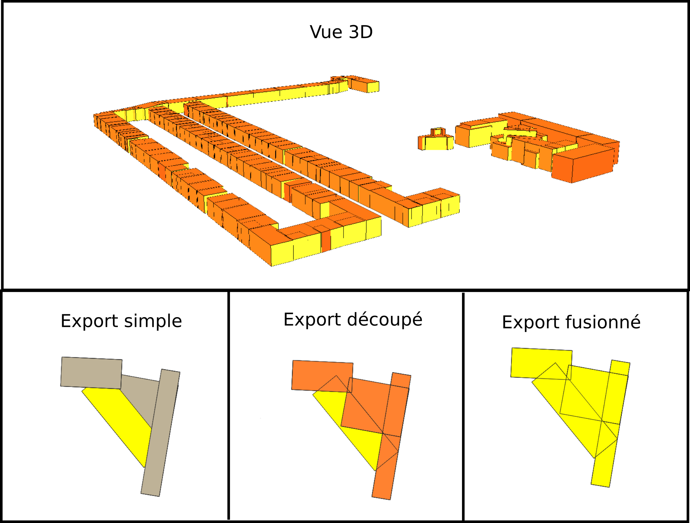

# Export général

Les objets produits par le simulateur sont stockés dans une instance de la classe  *GraphConfiguration*. Il est possible d'itérer sur les objets générés via le graphe associé. Le code ci-dessous montrer comment exporter sous forme d'un shapefile les résultats d'une simulation :


```JAVA
// Run of the optimisation on a parcel with the predicate
GraphConfiguration<Cuboid> cc = oCB.process(bPU, p, env, 1, pred);

// Witting the output
IFeatureCollection<IFeature> iFeatC = new FT_FeatureCollection<>();
// For all generated boxes
for (GraphVertex<Cuboid> v : cc.getGraph().vertexSet()) {

  // Output feature with generated geometry
  IFeature feat = new DefaultFeature(v.getValue().generated3DGeom());


  iFeatC.add(feat);

}

ShapefileWriter.write(featC,"tmp/result.shp");
```

# Export de boîtes

Comme les boîtes sont les objets actuellement les plus utilisées comme sorties de SimPLU3D, différentes méthodes pour les exportées avec différentes transformations ont été implémentées dans le projet SimPLU3D.

Chacune des classes mentionnées ci dessous possède un *main* pour voir comment les utiliser et l'image ci-dessous montre les différences entre ces résultats.


## Export simple des boîtes

La classe *fr.ign.cogit.simplu3d.io.shapefile.SaveGeneratedObjects*  permet d'exporter les boîtes en shapefile (méthode saveShapefile) ou dans une base PostGIS (méthode save) sous forme de MultiPolygon 3D (issus de la méthode *generated3DGeom*).

## Export découpé

Comme les boîtes générer peuvent s'intersecter, ces intersections sont potentiellement des sources de problèmes pour calculer des indicateurs sur les formes résultantes ou pour les visualiser.

Ainsi, la classe *fr.ign.cogit.simplu3d.util.merge.SDPCalc* permet d'exporter avec la méthode *getGeometryPairByGroup* les boîtes sous la forme d'une partition des géométries résultats avec une hauteur affectée à chaque patch. Le résultat contient un polygone 2D et une hauteur pour regénérer la forme en 3D.

Cet export facilite le calcul de la surface de plancher et de la surface 2D de la construction (méthode *process* et méthode *processSurface*).


## Export fusionné

La classe *fr.ign.cogit.simplu3d.util.merge.MergeCuboid* propose une fusion 3D des boîtes résultantes via la méthode *mergeFromShapefile*. Les faces intérieures sont supprimées et les boîtes générées en 3D. Ce cas est très utile pour la visualisation et le calcul de la surface extérieure avec la méthode *getSurface*.

L'attribut statique de cette classe *zMIN* permet de fixer l'altitude minimale au dessus de laquelle les boîtes seront extrudées.


## Synthèse des exports



L'image ci-dessus illustre les différents types d'exports. Si de base la vue 3D est la même pour les trois résultats les exports différents dans leur modélisation des entités et des géométries. La seconde partie de l'image montre dans une vue 2D la sélection d'une entité (en jaune) dans les trois types d'export :

- **Export simple** : une entité = une boîte avec une hauteur. Il y a donc beaucoup d'intersections entre objets ;
- **Export découpé** :  une entité = une géométrie découpée par l'intersection des autres géométries. Chaque composante géométrique peut être extrudée ce qui donne un dédoublement des faces verticales à l'intersection entre deux géométries découpées ;
- **Export fusionné** : une entité = une forme bâtie, c'est à dire la fusion des géométries qui s'intersectent. Ici, le résultat est géométriquement propre, il n'y a pas de doublon au niveau des faces verticales.
