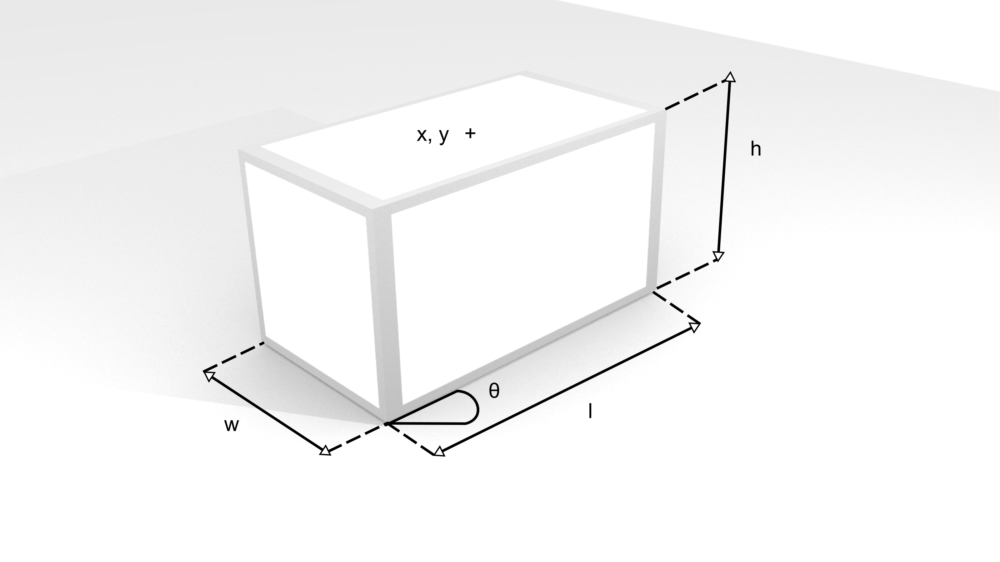

# Principe du fonctionnement du générateur de formes

Dans cette partie nous introduirons les différents aspects concernant la génération de formes dans SimPLU3D et la manière avec laquelle l'algorithme du recuit-simulé est utilisé.

# Configuration bâtie

Dans SimPLU3D, une configuration bâtie est composée d'un ensemble de géométries paramétriques. Une géométrie est dite paramétrique quand on peut la décrire à travers un vecteur de dimension constante. Dans la plupart des expérimentations de SimPLU3D, comme dans l'exemple de la première simulation, les géométries paramétriques manipulées sont des boîtes. Dans ce cas, s'agit d'une géométrie de 6 dimensions décrite par le vecteur **b** = (**x**, **y**, **l**, **w**, **h**, **θ**). Néanmoins, il est tout à fait possible d'utiliser d'autres types de géométries paramétriques comme nous le verrons dans la section sur la [personnalisation des formes générées](custom-generator.md).



# Génération de configurations bâties

La génération de formes bâties avec SimPLU3D se base sur la technique du recuit-simulé transdimensionnel. Le recuit simulé est une technique d'optimisation et le fait que l'approche soit transdimensionnel indique que c'est le système qui détermine le nombre d'objets nécessaires pour atteindre l'objectif.

Ainsi, si on considère une fonction d'optimisation **f**, comme le volume, le recuit simulé détermine les **n** boîtes et leurs paramètres qui permettent de produire la configuration bâtie la plus volumineuse possible.


# Déroulement de l'algorithme


L'algorithme est un algorithme itératif. À chaque itération, on considère une configuration bâtie courante. Le système choisit une modification parmi les noyaux de proposition de modification disponibles (dans l'exemple, le noyau d'ajout est sélectionné pour ajouter une nouvelle boîte). Ensuite, une probabilité d'acception est déterminée suivant la théorie du recuit simulée. Elle prend en compte les scores des configurations avant et après modification et la température courante (il s'agit d'une valeur qui décroît au fur et à mesure des itérations). Ainsi, il existe une certaine probabilité pour que cette modification soit rejetée (1 - α(t,s,s’)) et une certaine probabilité pour que la modification soit acceptée (α(t,s,s’)). Si la configuration est acceptée, on s'assure qu'elle respecte les règles morphologiques, si c'est le cas elle remplace la configuration courante sinon la modification est rejetée.

# Implémentation de l'algorithme

L'implémentation de l'algorithme est effectuée grâce à la bibliothèque générique et OpenSource [librjmcmc4j](https://github.com/IGNF/librjmcmc4j). Pour en savoir plus, vous pouvez consulter l'article :

> *Brédif, M., Tournaire, O.*, Aug. 2012. librjmcmc: An open-source generic c++ library for stochastic optimization. In: The XXII Congress of the International Society of Photogrammetry and Remote Sensing. ([https://www.int-arch-photogramm-remote-sens-spatial-inf-sci.net/XXXIX-B3/259/2012/isprsarchives-XXXIX-B3-259-2012.pdf](https://www.int-arch-photogramm-remote-sens-spatial-inf-sci.net/XXXIX-B3/259/2012/isprsarchives-XXXIX-B3-259-2012.pdf))

Dans l'exemple de la [première simulation](../begin/first_simulation.md), les étapes de l'algorithme, présentés dans le schéma précédent, s'effectue dans la méthode *process()* de la classe *OptimisedBuildingsCuboidFinalDirectRejection*. L'algorithme peut se décomposer en 3 phases :

- **Étape 1** : [la définition des configurations bâties et des modifications appliquées](custom-generator.md), ce qui correspond aux boîtes "Classe de géométrie paramétrique" et "Noyaux de propositions" du schéma ;
- **Étape 2** : [la définition des paramètres de l'algorithme en lui-même](custom-optimisation.md), c'est à-dire la fonction d'optimisation et les conditions initiales et d'arrêt ;
- **Étape 3** : [la mise en place de visiteurs](../visitor/intro.md), c'est à dire d'objets qui produiront des sorties au fur et à mesure de la simulation. Ils sont présentés dans une autre section mais n'influent pas sur le processus d'optimisation) ;
- **Étape 4** : l'exécution de la simulation.


```JAVA
/**
 * Process the generation of the optimization
 * @param bpu                    Basic property unit
 * @param geom                   The geometry in which the centroid of the
 *                               cuboids will be generated
 * @param p                      the parameters
 * @param env                    the environement
 * @param id                     the id of the experiments
 * @param pred                   the rules to check
 * @return a set of cuboid as a graph
 */
public GraphConfiguration<Cuboid> process(BasicPropertyUnit bpu, IGeometry geom, SimpluParameters p,
    Environnement env, int id,
    ConfigurationModificationPredicate<GraphConfiguration<Cuboid>, BirthDeathModification<Cuboid>> pred,
    List<Visitor<GraphConfiguration<Cuboid>, BirthDeathModification<Cuboid>>> lSupplementaryVisitors) {

    //Step 1 :

    // Sampler creation (definition of the class and of the kernel modifications)
    // Création de l'échantilloneeur (définition de la classe et des noyaux de modifications)
    Sampler<GraphConfiguration<Cuboid>, BirthDeathModification<Cuboid>> samp = create_sampler(Random.random(), p,
    bpu, pred, geom);

    //Step 2 : Preparation of the optimizer
    //Étape 2 : Préparation de l'optimiseur

    //Initializing the configuration (optimisation function + set of cuboid)
    //Initizialization de la configuration (fonction d'optimisation + stock les cuboids de la configuration courante
    GraphConfiguration<Cuboid> conf = null;
    try {
      conf = create_configuration(p, AdapterFactory.toGeometry(new GeometryFactory(), bpu.getGeom()), bpu);
    } catch (Exception e) {
      e.printStackTrace();
    }

    // Temperature initialization
    //Initialization de la fonction de la température
    Schedule<SimpleTemperature> sch = create_schedule(p);


    //The end test condition
    end = create_end_test(p);

    //Step 3 : Visitor instanciation
    //Étape 3 : Préparation des visiteurs

    //The visitors initialisation
    PrepareVisitors<Cuboid> pv = new PrepareVisitors<>(env, lSupplementaryVisitors);
    CompositeVisitor<GraphConfiguration<Cuboid>, BirthDeathModification<Cuboid>> mVisitor = pv.prepare(p, id);

    //Step 4 : Running the optimization process
    //Étape 4 : Exécution de l'optimization
    SimulatedAnnealing.optimize(Random.random(), conf, samp, sch, end, mVisitor);
    return conf;
}
```
