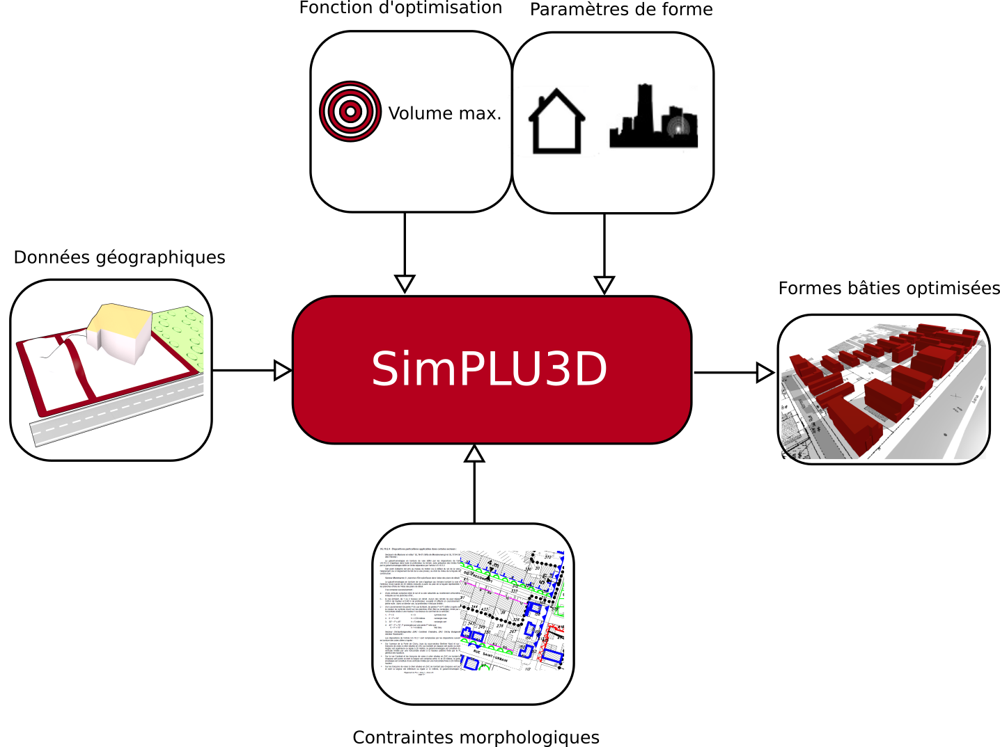

# Documentation de SimPLU3D

SimPLU3D est un ensemble de bibliothèques Java Open-Source qui permet de simuler des formes bâties en 3D optimisant une fonction à partir de contraintes morphologiques. Ces codes peuvent être utiliser pour questionner le rapport entre des contraintes morphologiques (par exemple issues de réglementation) et les formes produites à l'échelle du quartier ou de l'agglomération. L'approche de SimPLU3D est générique dans le sens où il est possible de définir ses propres contraintes, fonctions d'optimisations ou types de formes. L'ensemble de ces bibliothèque est disponible dans l'organisation Github [SimPLU3D](https://github.com/SimPLU3D).

Principe de fonctionnement de SimPLU3D
Cette bibliothèque a notamment été utilisée pour modéliser des formes bâties à partir de contraintes issues de [Plans Locaux d'Urbanisme (PLU)](https://fr.wikipedia.org/wiki/Plan_local_d%27urbanisme) et permet de répondre à ce type de questions :
> Quelle est la quantité de logements que l'on peut bâtir sur une parcelle ?

> Comment est-ce que la forme de mon quartier va évoluer si l'on change un PLU  ?

> Est-ce que des bâtiments faisaient une ombre trop importante sur les parcelles voisines peuvent être construits ?

SimPLU3D a déjà fait l'objet de plusieurs applications et publications, n'hésitez pas consulter [la liste des réalisations et publications](bibliographie.md).

SimPLU3D est développé et maintenu par le laboratoire [LASTIG](http://lastig.ign.fr/) de l'[Institut National de l'Information Géographique et Forestière](https://fr.ign.com/). N'hésitez pas à [nous contacter](about.md) pour nous fait un retour sur SimPLU3D ou pour utiliser le code.

Cette documentation a pour but de montrer comment utiliser SimPLU3D et de paramétrer l'approche en fonction de vos besoins. Pour commencer, la première étape est d'installer les bibliothèques et de lancer une première simulation [(par ici)](./begin/intro.md).

La conception et le développement de SimPLU3D ont été initiés dans le cadre de la thèse :
> Brasebin, M. (2014) Les données géographiques 3D pour simuler l'impact de la réglementation urbaine sur la morphologie du bâti, Thèse de doctorat, spécialité Sciences et Technologies de l'Information Géographique, Université Paris-Est, apr 2014 [Mémoire](https://tel.archives-ouvertes.fr/tel-01124257), [Présentation](http://recherche.ign.fr/labos/util_basilic/publicDownload.php?id=3011)
