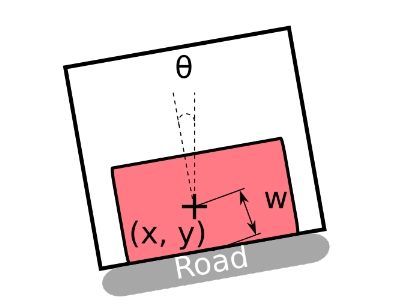

Le fonctionnement de base de SimPLU3D qui consiste à tirer des valeurs aléatoires dans un espace continu rend difficile l'application de contraintes topologiques. Si on prend l'exemple de l'alignement aux limites séparatives donnant sur une route (cf image ci-dessous), il est totalement improbable que SimPLU3D effectue le tirage d'une boîte respectant cet alignement (cela revient à tirer exactement le bonne valeur de x,y,w et θ).

# Stratégie 1 : transformation en contrainte géométrique

La stratégie naïve consisterait à transformer la contrainte topologique en contrainte géométrique. Par exemple, de vérifier si l'un des côtés de la boîte est inclus dans un buffer de petite taille autour de la limite donnant sur la voirie.

Cela rend probable la proposition de boîtes par le système, mais comme cette probabilité reste relativement faible, il peut être nécessaire d'augmenter le nombre d'itérations afin d'atteindre un résultat optimisé.

# Stratégie 2 :  génération de boîtes alignées

La seconde stratégie consiste à non plus générer des boîtes libres, mais des boîtes directement alignées sur la limite considérée. Il s'agit ainsi de définir un nouveau générateur de forme (comme décrit dans la section [**Générateur de formes - Générer d'autres types de formes**]( ../generator/custom-shape.md)).

Il s'agit non plus de générer des boîtes à 6 dimensions ( **b** = (**x**, **y**, **l**, **w**, **h**, **θ**)), mais des boîtes parallèles à 4 dimensions ( **bp** = (**x**, **y**, **l**, **h**). en considérant que l'orientation et la largeur sont imposées par les coordonnées.
